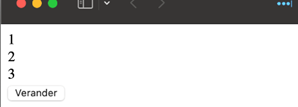
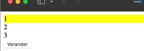
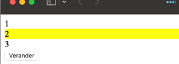
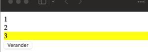

# Verander divs

Maak een nieuw VITE project `verander-divs`. Je kan ook vertrekken van het [starterproject](/exercise-files/frontend/verander-divs/starter.zip) met de HTML en CSS voor deze oefening.

Zet in je HTML drie divs onder elkaar en schrijf een script om de achtergrondkleur van een div te laten veranderen na een klik op de knop. Achtergrond 1 zal veranderen na de eerste klik op de knop, bij de tweede klik wordt achtergrond 1 terug weggehaald en krijgt div 2 de achtergrond enzovoorts

Als je aan achtergrond 3 bent, spring je terug naar 1.

Kies zelf of je een inline event handler of event listener gebruikt.

<figure>

<figcaption></figcaption>

</figure>

<figure>

<figcaption></figcaption>

</figure>

<figure>

<figcaption></figcaption>

</figure>

<figure>

<figcaption></figcaption>

</figure>
