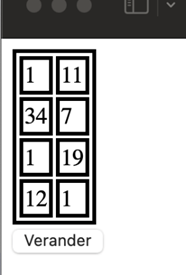
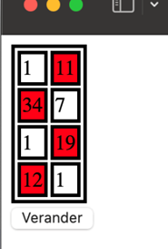

# Verander kleuren

Maak een nieuw VITE project `verander-kleuren`. Je kan ook vertrekken van het [starterproject](/exercises/frontend/verander-kleuren/starter.zip) met de HTML en CSS voor deze oefening.

Maak in HTML een tabel aan met waardes tussen 1 en 99 zoals hieronder.

Schrijf vervolgens een script dat alle achtergrondkleur van alle cellen waarvan de waarde groter dan 10 is rood maakt.

<figure>

<figcaption></figcaption>

</figure>

<figure>

<figcaption></figcaption>

</figure>
