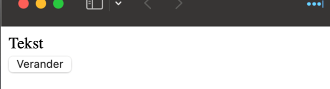
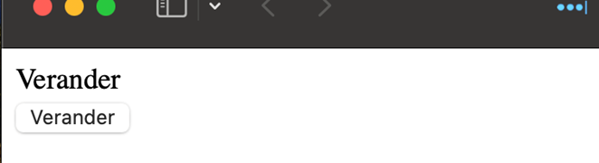

# Verander tekst

Maak een nieuw VITE project `verander-tekst`. Je kan ook vertrekken van het [starterproject](/exercises/frontend/verander-tekst/starter.zip) met de HTML en CSS voor deze oefening.

Schrijf HTML en een script dat de tekst van een div laat veranderen na klikken op de knop 'verander'. Als je een tweede maal op de knop drukt, wordt de tekst terug het originele.

Kies zelf of je een inline event handler of event listener gebruikt.

<figure>

<figcaption></figcaption>

</figure>

<figure>

<figcaption></figcaption>

</figure>
