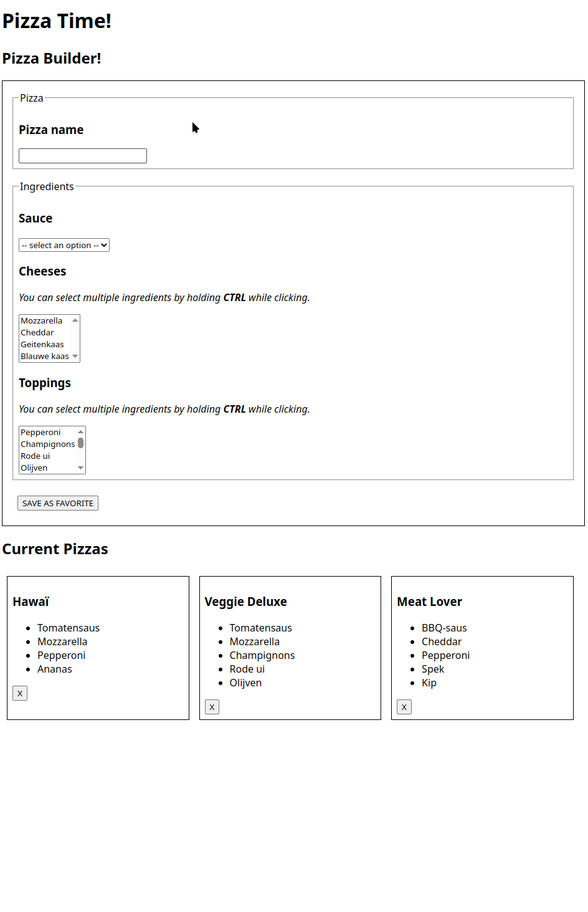

# Pizza Builder

Vertrek van dit [starterproject](/exercise-files/full-stack/pizza-builder/starter.zip) voor de client. Het bevat de HTML en CSS; de TypeScript-code werk je zelf uit.

## Doel van de oefening

Je gaat een webapplicatie bouwen in twee delen:

1. **Pizza Builder**
   * Met dit formulier kan je een nieuwe pizza samenstellen.
   * De ingredienten worden ingeladen vanuit de database.
   * Je kan meerdere soorten kaas en meerdere soorten toppings selecteren.
   * Je kan slechts één soort saus selecteren.
2. **Pizza Overview**
   * Een overzicht van alle opgeslagen pizza's.
   * Elke pizza heeft een verwijder-knop. Hiermee wordt de pizza verwijdert uit het systeem.
     * *Bekijk de database-structuur aandachtig! Een pizza bestaat enerzijds uit een record uit de `pizzas` tabel, maar ook uit records uit de `pizza_ingredients` tabel!*



## Functionaliteiten

### 1. Front-end (Vite + TypeScript)

* Haal de ingredienten op via uit je database
* Splits de lijst op volgens type:
  * sauzen
  * kazen
  * toppings
* Toon elk ingredient in het juiste `<select>` element.
  * Gebruik het `multiple` attribute om een multi-select te maken.

### 2. Back-end (Express + MySQL)

Je maakt endpoints aan om pizza's terug te geven en aan te maken:

**Endpoints**

* `GET /pizzas`: Geeft een lijst terug van alle pizza's
* `POST /pizzas`: Maak een nieuwe pizza aan, en link de pizza aan de juiste ingredienten in de `pizza_ingredients` tabel
* `DELETE /pizzas`: Verwijdert een pizza, en verwijdert ook alle records van die pizza uit de `pizza_ingredients` tabel
* `GET /ingredients`: Geeft een lijst terug van alle ingredienten

## Stappenplan

### 1. Voorbereiding

* Zet je Frontend-project op met Vite
* Zet je backend project op met Express
* Configureer een lokale MySQL-database

<details>

<summary>Database SQL init</summary>

```sql
CREATE TABLE ingredients (
  id INT AUTO_INCREMENT PRIMARY KEY,
  name VARCHAR(100) NOT NULL,
  type ENUM('sauce', 'cheese', 'topping') NOT NULL
);

CREATE TABLE pizzas (
  id INT AUTO_INCREMENT PRIMARY KEY,
  name VARCHAR(100) NOT NULL
);

CREATE TABLE pizza_ingredients (
  pizza_id INT,
  ingredient_id INT,
  PRIMARY KEY (pizza_id, ingredient_id),
  FOREIGN KEY (pizza_id) REFERENCES pizzas(id) ON DELETE CASCADE,
  FOREIGN KEY (ingredient_id) REFERENCES ingredients(id)
);

INSERT INTO ingredients (id, name, type) VALUES
-- Sauzen
(1, 'Tomatensaus', 'sauce'),
(2, 'BBQ-saus', 'sauce'),
(3, 'Witte knoflooksaus', 'sauce'),

-- Kazen
(4, 'Mozzarella', 'cheese'),
(5, 'Cheddar', 'cheese'),
(6, 'Geitenkaas', 'cheese'),
(7, 'Blauwe kaas', 'cheese'),

-- Toppings
(8, 'Pepperoni', 'topping'),
(9, 'Champignons', 'topping'),
(10, 'Rode ui', 'topping'),
(11, 'Olijven', 'topping'),
(12, 'Ananas', 'topping'),
(13, 'Paprika', 'topping'),
(14, 'Spek', 'topping'),
(15, 'Spinazie', 'topping'),
(16, 'Artisjok', 'topping'),
(17, 'Kip', 'topping');

INSERT INTO pizzas (id, name) VALUES
(1, 'Hawaï'),
(2, 'Veggie Deluxe'),
(3, 'Meat Lover');

-- Hawaï: Tomatensaus, Mozzarella, Ananas, Ham/Pepperoni
INSERT INTO pizza_ingredients (pizza_id, ingredient_id) VALUES
(1, 1),  -- Tomatensaus
(1, 4),  -- Mozzarella
(1, 12), -- Ananas
(1, 8);  -- Pepperoni

-- Veggie Deluxe: Tomatensaus, Mozzarella, Champignons, Rode ui, Olijven
INSERT INTO pizza_ingredients (pizza_id, ingredient_id) VALUES
(2, 1),  -- Tomatensaus
(2, 4),  -- Mozzarella
(2, 9),  -- Champignons
(2, 10), -- Rode ui
(2, 11); -- Olijven

-- Meat Lover: BBQ-saus, Cheddar, Kip, Pepperoni, Spek
INSERT INTO pizza_ingredients (pizza_id, ingredient_id) VALUES
(3, 2),  -- BBQ-saus
(3, 5),  -- Cheddar
(3, 17), -- Kip
(3, 8),  -- Pepperoni
(3, 14); -- Spek
```

</details>

### 2. Front-end implementatie

* Maak een module `pizzabuilder.ts` om de ingrediënten en pizza’s via je eigen API op te vragen
* Bouw componenten voor:
  * Pizzaformulier
  * Pizzaoverzicht

### 3. Back-end implementatie

* Schrijf de nodige Express-routes
* Verbind je server met MySQL en implementeer de CRUD-logica
* Zorg ervoor dat alle routes JSON teruggeven

Stuur bij `POST /pizzas` de naam en de geselecteerde ingrediënt-id’s door. Bijvoorbeeld:

```json
{ "name": "Mijn pizza", "ingredientIds": [1, 4, 9] }
```

Stuur bij `DELETE /pizzas` het id van de pizza door:

```json
{ "id": 1 }
```

Controleer op de server dat de geselecteerde ingrediënten bestaan en dat een pizza precies één saus heeft.

## Werkwijze

Werk met een apart Vite-project voor de client en een Express-project voor de server, zoals in [Van form naar database](../../../full-stack/vite-planeten.md). Geef je interfaces, functies en DOM-selectors de juiste TypeScript-types. Configureer [CORS](../../../full-stack/cors.md) zodat de client op `http://localhost:5173` de API op `http://localhost:3000` kan aanspreken. Alle endpoints geven JSON terug.

Gebruik de werkwijze uit [MySQL in Express.js](../../../mysql/gebruik-in-express.md): zet de verbinding en alle databasefuncties in `database.ts`. Gebruik `mysql2/promise`, `async/await` en `execute()` met placeholders. Registreer `SIGINT` in `connect()` en sluit de verbinding in `exit()`. Zet de routes in een apart routerbestand.
