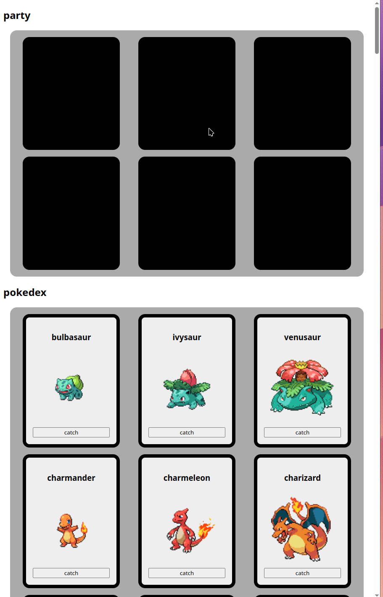

# Pokémon app met party

Vertrek van dit [starterproject](/exercise-files/full-stack/pokemon-app-bis/starter.zip) voor de client. Het bevat de HTML en CSS; de TypeScript-code werk je zelf uit.

## Doel van de oefening

Je gaat een webapplicatie bouwen in twee delen:

1. **Pokedex-overzicht**
   * Haalt gegevens op van [https://pokeapi.co](https://pokeapi.co) en toont een lijst van Pokémon.
   * Gebruikt je eigen Express-backend om te tonen welke Pokémon je gevangen hebt. 
     * Pokémon die nog niet gevangen zijn krijgen een knop waarmee je de Pokémon kunt "vangen" (dus toevoegen aan je database met gevangen Pokémon).
     * Pokémon die al wel gevangen zijn krijgen een knop waarmee je de Pokémon kunt "vrijlaten" (dus verwijderen uit je database met gevangen Pokémon).
2. **Jouw Pokémon Party** – Synchroniseert met je eigen Express-backend (en MySQL-database)
   * Haalt op welke Pokémon momenteel in je party zitten (max 6)
     * Pokémon die al gevangen zijn, maar nog niet in je party zitten krijgen een knop waarmee je de Pokémon kunt toevoegen aan je party.
     * Pokémon die al gevangen zijn, en al wel in je party zitten, krijgen een knop waarmee je de Pokémon kunt verwijderen uit je party.



## Functionaliteiten

### 1. Front-end (Vite + TypeScript)

* Haal de eerste 151 Pokémon op via `https://pokeapi.co/api/v2/pokemon?limit=151`
* Voor elke Pokémon in de lijst:
  * Toon naam en afbeelding (sprites uit `https://pokeapi.co/api/v2/pokemon/{id}`)
  * Duid aan of deze Pokémon al gevangen is
  * Voeg een knop toe: “Vang” of “Laat los” (afhankelijk van vangstatus)
* Toon je party met max. 6 Pokémon bovenaan de pagina:
  * De party bevat enkel gevangen Pokémon
  * Voeg knop toe om Pokémon aan/uit je party te zetten

### 2. Back-end (Express + MySQL)

Je maakt endpoints aan om de vangstatus en party bij te houden:

**Endpoints**

* `GET /pokedex`: Geef een lijst van gevangen Pokémon (ids)
* `POST /pokedex`: Vang een Pokémon (body: `{ id: number }`)
* `DELETE /pokedex`: Laat een Pokémon los **en verwijdert deze ook uit de party als die erin zit** (body: `{ id: number }`)
* `GET /party`: Geef de party terug (lijst van max 6 Pokémon ids)
* `POST /party`: Voeg een Pokémon toe aan de party (body: `{ id: number }`)
* `DELETE /party`: Verwijder een Pokémon uit de party (body: `{ id: number }`)

## Stappenplan

### 1. Voorbereiding

* Zet je Frontend-project op met Vite
* Zet je backend project op met Express
* Configureer een lokale MySQL-database

<details>

<summary>Database SQL init</summary>

```sql
CREATE TABLE caught_pokemon (
  id INT PRIMARY KEY
);

CREATE TABLE party (
  id INT PRIMARY KEY,
  FOREIGN KEY (id) REFERENCES caught_pokemon(id)
);
```

:::warning
**Let op:** Dit zorgt ervoor dat je enkel een Pokémon aan je party kunt toevoegen als deze ook in de `caught_pokemon`-tabel staat.
:::

</details>

### 2. Front-end implementatie

* Maak een module `pokedex.ts` om de data voor je pokédex op te vragen
* Maak een module `pokemonparty.ts` om de data voor je Pokémon party op te vragen
* Bouw componenten voor:
  * Pokédex-lijst
  * Party overzicht

### 3. Back-end implementatie

* Schrijf de nodige Express-routes
* Verbind je server met MySQL en implementeer de CRUD-logica
* Zorg ervoor dat alle routes JSON teruggeven

***

## Bonusuitdagingen

* Voeg een zoekfunctie toe aan de Pokédex
* Voeg loading-states toe
* Toon een toast-notificatie bij het vangen of verwijderen van een Pokémon

## Werkwijze

Werk met een apart Vite-project voor de client en een Express-project voor de server, zoals in [Van form naar database](../../../full-stack/vite-planeten.md). Geef je interfaces, functies en DOM-selectors de juiste TypeScript-types. Configureer [CORS](../../../full-stack/cors.md) zodat de client op `http://localhost:5173` de API op `http://localhost:3000` kan aanspreken. Alle endpoints geven JSON terug.

Gebruik de werkwijze uit [MySQL in Express.js](../../../mysql/gebruik-in-express.md): zet de verbinding en alle databasefuncties in `database.ts`. Gebruik `mysql2/promise`, `async/await` en `execute()` met placeholders. Registreer `SIGINT` in `connect()` en sluit de verbinding in `exit()`. Zet de routes in een apart routerbestand.
