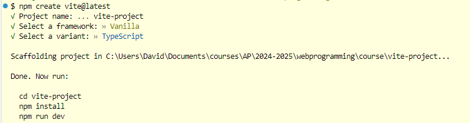

# VITE

## Introductie

VITE is een moderne frontend tool die ontworpen is om de ontwikkeling van webapplicaties drastisch te versnellen. Het maakt gebruik van native ES modules, waardoor het direct bestanden naar de browser kan sturen zonder dat er een volledige bundel hoeft te worden gemaakt. Dit resulteert in een razendsnelle webserverstart en een extreem snelle Hot Module Replacement (HMR), wat betekent dat wijzigingen in je code bijna direct zichtbaar zijn in de browser.

<figure>


<figcaption></figcaption>

</figure>

VITE biedt een uitgebreide featureset, waaronder ondersteuning voor TypeScript en CSS, en is het zeer flexibel dankzij een groot aantal plugins. VITE is dus een krachtige en gebruiksvriendelijke tool die het ontwikkelproces aanzienlijk efficiënter maakt.

> Meer info vind je terug op [https://vitejs.dev/guide](https://vitejs.dev/guide)

## Creatie van een nieuw VITE project

In de lessen gebruiken we GIT Bash als terminal in vs-code. Gebruik volgend commando in je terminal om een nieuw VITE project te starten.

```
npm create vite@latest
```

Vite vraagt je dan 3 zaken.

1. Wens je de laatste versie te installeren?  -> **Y**
2. Naam van je project? -> **Kies een naam**
3. Welke technologie wens je te gebruiken? -> **Vanilla / Typescript**

<figure>



<figcaption><p>aanmaak nieuw vite-project</p></figcaption>

</figure>

### **Dit kan sneller!**

```
npm create vite@latest . -- --template vanilla-ts
```

Dit commando maakt een typescript project aan in de huidige folder van je terminal.

## Ophalen van nodige dependencies

Voer het commando 'npm install' of kortweg 'npm i'. Dit zal de dependencies aangegeven in de package.json installeren. In dit project installeert dit Vite en Typescript.

Een vite project kan worden uitgevoerd in 2 omgevingen. De zogenaamde 'environments'.

1. Development
2. Production

### Development mode

Je werkt voornamelijk in Development mode. Vite maakt een webserver aan bereikbaar via [http://localhost:5173](http://localhost:5173) en je geniet nu van automatisch omzetting van typescript bestanden naar javascript en al je aanpassingen verschijnen onmiddellijk in je webbrowser. Je kan de webserver afsluiten doormiddel van de 'ctrl + c' shortcut in je terminal.

### Build mode

In build mode gaat Vite al je bestanden optimaliseren voor het web. Als je 'npm run build' uitvoert in een Vite-project, transformeert Vite al je ontwikkelingscode en assets naar een lichtgewicht, snelle, en goed geoptimaliseerde versie van je applicatie, klaar voor productie.

:::tip
Het resultaat van deze npm run build is een geoptimaliseerde versie van je project in een map genaamd **dist**, die je rechtstreeks kunt deployen naar een webserver.
:::

1. Productiebundeling

Optimalisatie van Modules: Vite gebruikt Rollup, een krachtige bundler, om je broncode te optimaliseren en samen te voegen. Het combineert al je JavaScript, CSS, en andere bronnen in een of meerdere geoptimaliseerde bestanden die klaar zijn voor productie.&#x20;

Tree Shaking: Vite verwijdert onnodige code (dead code) uit je project om de uiteindelijke bundel zo klein mogelijk te maken. Dit gebeurt door alleen de code die daadwerkelijk gebruikt wordt te behouden.&#x20;

Code Splitting: Vite kan je code automatisch opdelen in kleinere stukken (chunks), waardoor alleen de noodzakelijke code geladen wordt op het moment dat het nodig is. Dit zorgt voor snellere laadtijden van je applicatie.

2. CSS Behandeling:

CSS Minificatie: Vite minimaliseert je CSS, waardoor de bestandsgrootte kleiner wordt. Dit betekent dat spaties, nieuwe regels, en overbodige tekens worden verwijderd.&#x20;

Autoprefixing: Indien je PostCSS of een andere CSS verwerkingslaag gebruikt, kan Vite zorgen voor automatisch toevoegen van vendor prefixes (zoals -webkit- of -moz-), zodat je CSS compatibel is met verschillende browsers.

3. Assets Optimalisatie:

In-line Assets: Kleinere assets (zoals afbeeldingen of SVG's) worden soms in de bundel zelf geïnlineerd als Base64-gecodeerde strings. Dit vermindert het aantal netwerkverzoeken.&#x20;

File Hashing: Vite voegt een hash toe aan de bestandsnamen van je gebundelde assets (bijv. main.abc123.js), wat cachingproblemen voorkomt bij updates van je website.

4. Minificatie van JavaScript:

Vite gebruikt Terser of Esbuild om je JavaScript-code te minificeren, wat betekent dat alle overbodige tekens zoals spaties, nieuwe regels, en opmerkingen worden verwijderd. Dit verkleint de bestandsgrootte aanzienlijk.

5. HTML Transformatie:

Tijdens het builden analyseert en optimaliseert Vite je HTML-bestanden. Het past ook de juiste links naar CSS en JavaScript aan, zodat ze verwijzen naar de geoptimaliseerde versies van de bestanden.

:::tip
Van zodra je 'npm run build' hebt uitgevoerd krijg je een 'dist' folder met je geoptimaliseerde frontend code. Die kan je dus gaan publishen op het web. In het volgende hoofdstuk maken we gebruik van **Surge.sh** om onze webpage te publishen/hosten.
:::
